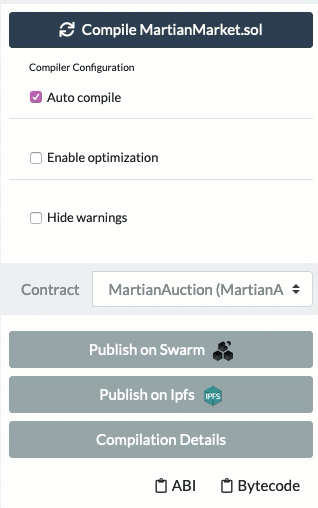

# Deploying the MartianMarket

In this activity, you will create a landing page and deploy the MartianMarket dApp to your Github Pages account.

## Instructions

* Create a fresh directory in your workspace called `martian_market`:

  ```bash
  mkdir martian_market
  cd martian_market
  ```

* Move the frontend code from the `Resources/martian_market/frontend` folder into your `martian_market` folder. The path should be `YOUR_WORKSPACE/martian_market/frontend`.

* In Remix, deploy a fresh `MartianMarket` contract.

* Copy over the ABIs from `MartianMarket` and `MartianAuction` into separate `MartianMarket.json` and `MartianAuction.json` files inside the `frontend` folder. This is necessary for the frontend to talk to the contract backend.

  * Replace the contents of the example ABIs with your own. Your contract was built using the same structure, so the example ABI should work anyway, but to be sure, provide your own. You **must** have used the same names of the public functions as the example [solution](Resources/martian_market/MartianMarket.sol), otherwise, neither will work.

  * Make sure to copy over the correct ABIs for each contract. You will have to manually select `MartianMarket` contract from the compiler menu:

  

* At the top of the `dapp.js` frontend code, set the `contractAddress` variable to equal your deployed contract.

* Ensure you have pasted your contract's ABIs into their corresponding `json` files and updated the `contractAddress` variable before moving on.

* Create a `README.md` inside the top-level `martian_market` folder.

  * You can model the structure from the `Resources/martian_market` folder.

* Within this `README.md` file, add some information explaining the application.

  You **must** include a link to the dApp's `frontend` directory by linking to `frontend/index.html` at least once, otherwise, the point of the landing page is lost!

  The syntax for a link in Markdown is `[Link Text Here](https://url_here)`. You can directly link to the `frontend/index.html` file with something like

  ```markdown
  [Frontend Code Link Text](frontend/index.html)
  ```

  For example:

  ```markdown
  # MartianMarket

  ## Summary

  This application is an online auction system for the Martian Land Foundation to auction available resources on Mars.

  ### Demo App

  Click [here](frontend/index.html) to launch the MartianMarket application.
  ```

* Take the time to explain how the application was built. Explain things like how the contracts work, what the purpose of the application is, and how to use it.

  * Include codeblocks and even explain your raw code if you would like to present this to a future employer. Get creative!

  * Use this [Markdown Syntax Cheatsheet](https://github.com/adam-p/markdown-here/wiki/Markdown-Cheatsheet) for quick reference on how to style various aspects of your text.

* Once you've got a good summary going, create a new Github repository by navigating to [Github](https://github.com), clicking the `+` at the top right, and selecting `New Repository`.

  * Give it a title and short description. Set it to public, and do not initialize with a `README`, since you have one already. Create the repository.

* Run the first set of commands that Github provides for uploading existing code to the repo, minus the first line of code that `echo`s to the `README.md` file (since there is already content in there).

  * Once you run this set of commands, you will need to upload the rest of the frontend code, since the first set only uploads the `README.md`. Make sure you are in the top level `martian_market` folder and run:

    ```bash
    git add -A
    git commit -m "add frontend code"
    git push
    ```

    * After running this, all of the code should be uploaded to the repository.

* Navigate to the repo settings on Github by clicking the `Settings` tab, and scroll down to the `Github Pages` section, and set the `Source` to `master`.

* Click the theme chooser, pick a theme, then navigate to the URL that Github Pages provides. You should see your website generated! **(This may take a few moments to reflect and may need a refresh.)**

* Once on the landing page, check out your beautiful work, then click on the link that you generated to take you to your dApp. Ensure MetaMask is pointed at the same network that you've deployed the contract to. The dApp should request permissions to connect, and once on the same network the contract is deployed to, the contract data should populate.

* This frontend works similarly to the `CryptoRight` frontend, but here's a breakdown:

  * If you are using the same account in MetaMask as the `foundation_address` you deployed from, you should see some admin related UI elements.

    * Use your Pinata API keys to upload images of Martian land and pair them with a name.

    * Clicking `Register Land` should send a transaction to the `registerLand` function of the contract.

    * Clicking `End Auction` on a token will end an auction (as long as it has a bid).

  * If you switch accounts to another address in MetaMask, you will only be able to `bid` on tokens. Try bidding some Ether from one account, then finalizing the auction from the `foundation_address`. When you are outbid, you will be able to click the `Withdraw` button to withdraw from your `pendingReturns`.

  * You will need to refresh the dApp once you receive the `Transaction Confirmed` notification from MetaMask, as this frontend is not as reactive.

## Challenge

* This landing page faces the world. Try to make this site as compelling as possible by capturing the exciting elements of your hard work!

## Hints

* In case you need some help with Markdown, use this [Markdown Syntax Cheatsheet](https://github.com/adam-p/markdown-here/wiki/Markdown-Cheatsheet) for quick reference on how to style various aspects of your text.

* Github also provides a [Markdown Reference](https://help.github.com/en/github/writing-on-github/basic-writing-and-formatting-syntax).
